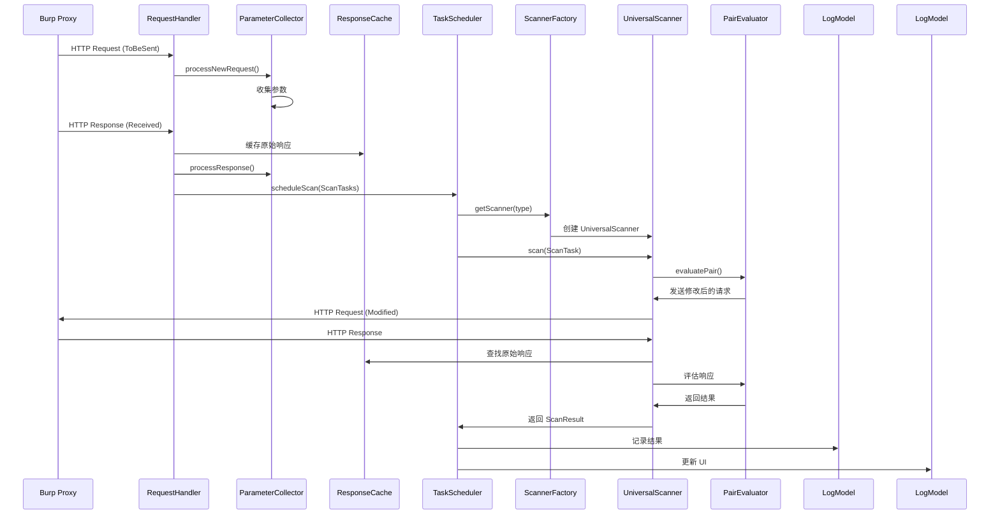
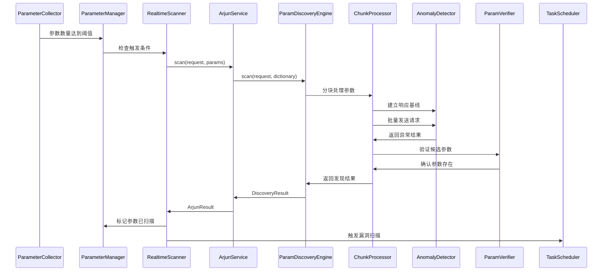
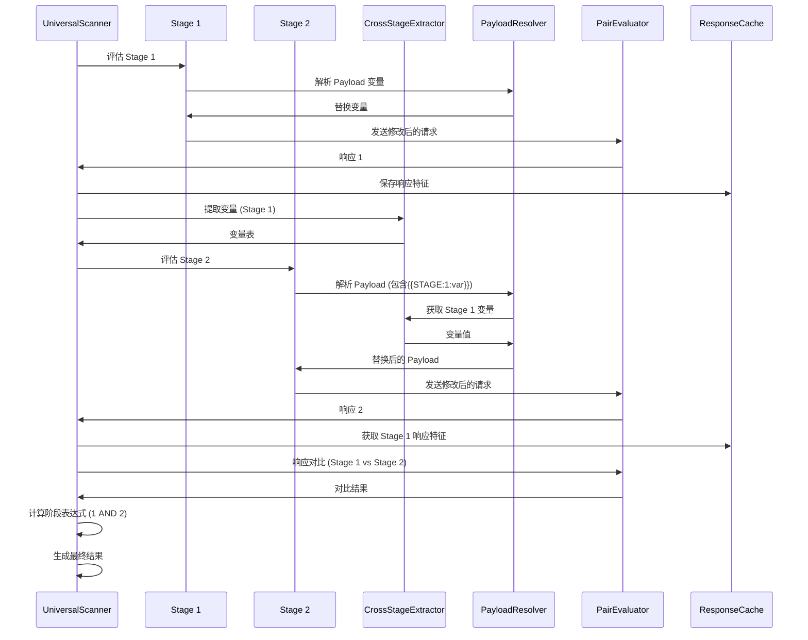
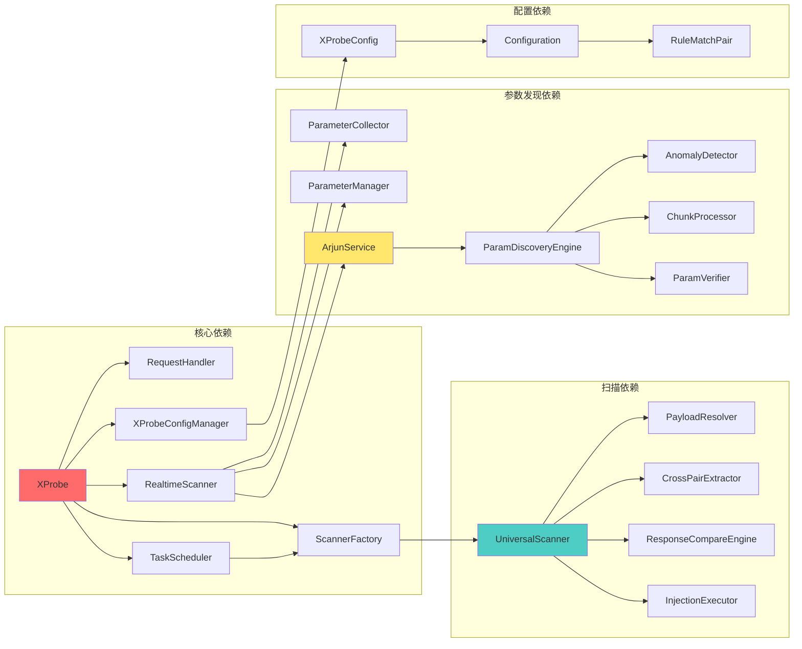

# XProbe 架构拓扑图与模块详解

> 本文档详细描述 XProbe 的整体架构、模块划分、数据流和组件关系
> 
> **架构名称**：多阶段链式检测架构（Multi-Stage Chain Detection Architecture, MSCDA）

## 📐 整体架构拓扑图

```mermaid
graph TB
    subgraph "Burp Suite Montoya API"
        MontoyaAPI[Montoya API]
    end
    
    subgraph "XProbe 主入口层"
        XProbe[XProbe.java<br/>主入口类]
        XProbe -->|初始化| ConfigMgr[XProbeConfigManager<br/>配置管理器]
        XProbe -->|创建| RequestHandler[RequestHandler<br/>HTTP请求处理器]
        XProbe -->|创建| RealtimeScanner[RealtimeScannerRefactored<br/>实时扫描器]
        XProbe -->|创建| TaskScheduler[TaskScheduler<br/>任务调度器]
        XProbe -->|创建| UIMain[UI Main Tab<br/>主界面]
    end
    
    subgraph "配置管理层"
        ConfigMgr -->|加载| XProbeConfig[XProbeConfig<br/>统一配置类]
        ConfigMgr -->|管理| ConfigPersistence[ConfigPersistence<br/>配置持久化]
        ConfigMgr -->|管理| ConfigStorage[ConfigStorage<br/>配置存储]
        XProbeConfig -->|包含| Configuration[Configuration<br/>扫描规则配置]
        XProbeConfig -->|包含| GlobalFilter[GlobalFilter<br/>全局过滤器]
    end
    
    subgraph "HTTP 请求处理层"
        RequestHandler -->|注册到| MontoyaAPI
        RequestHandler -->|过滤| RequestFilter[RequestFilter<br/>请求过滤器]
        RequestHandler -->|缓存| ResponseCache[OriginalResponseCache<br/>原始响应缓存 LRU]
        RequestHandler -->|参数收集| RealtimeScanner
        RequestHandler -->|调度扫描| TaskScheduler
        RequestFilter -->|使用| GlobalFilter
    end
    
    subgraph "实时扫描层 (被动)"
        RealtimeScanner -->|管理| ParameterCollector[ParameterCollector<br/>参数收集器]
        RealtimeScanner -->|管理| ParameterManager[ParameterManager<br/>参数管理器]
        RealtimeScanner -->|调用| ArjunService[ArjunService<br/>参数发现服务]
        RealtimeScanner -->|触发| TaskScheduler
        ParameterCollector -->|收集| ArjunService
        ParameterManager -->|增量计算| ParameterCollector
    end
    
    subgraph "任务调度层"
        TaskScheduler -->|使用| ThreadPool[ThreadPoolExecutor<br/>可配置线程池]
        TaskScheduler -->|创建扫描器| ScannerFactory[ScannerFactory<br/>扫描器工厂]
        TaskScheduler -->|记录结果| LogModel[LogModel<br/>日志模型]
        TaskScheduler -->|查找缓存| ResponseCache
        ScannerFactory -->|创建| UniversalScanner[UniversalScanner<br/>通用扫描器]
    end
    
    subgraph "扫描引擎层"
        UniversalScanner -->|评估检测阶段| StageEvaluator[Stage评估引擎]
        UniversalScanner -->|解析变量| PayloadResolver[PayloadVariableResolver<br/>Payload变量解析器]
        UniversalScanner -->|提取变量| CrossStageExtractor[CrossStageVariableExtractor<br/>跨阶段变量提取器]
        UniversalScanner -->|对比响应| ResponseCompareEngine[ResponseComparisonEngine<br/>响应对比引擎]
        UniversalScanner -->|执行注入| InjectionExecutor[InjectionPointExecutor<br/>注入点执行器]
        UniversalScanner -->|HTTP请求| MontoyaAPI
        UniversalScanner -->|查找缓存| ResponseCache
        PairEvaluator -->|请求评估| UnifiedHttpEvaluator[UnifiedHttpEvaluator<br/>统一HTTP评估器]
        PairEvaluator -->|响应评估| UnifiedResponseEvaluator[UnifiedResponseEvaluator<br/>统一响应评估器]
    end
    
    subgraph "参数发现层 (Arjun)"
        ArjunService -->|调用| ParamDiscoveryEngine[ParamDiscoveryEngine<br/>参数发现引擎]
        ParamDiscoveryEngine -->|分块处理| ChunkProcessor[ChunkProcessor<br/>分块处理器]
        ParamDiscoveryEngine -->|异常检测| AnomalyDetector[AnomalyDetector<br/>异常检测器]
        ParamDiscoveryEngine -->|HTTP请求| BurpHttpRequester[BurpHttpRequester<br/>HTTP请求器]
        ParamDiscoveryEngine -->|并发控制| ConcurrentProcessor[ConcurrentProcessor<br/>并发处理器]
        ParamDiscoveryEngine -->|错误处理| ErrorHandler[ErrorHandler<br/>错误处理器]
        ParamDiscoveryEngine -->|重试策略| RetryStrategy[RetryStrategy<br/>重试策略]
        ParamDiscoveryEngine -->|速率限制| RateLimiter[RateLimiter<br/>速率限制器]
        ChunkProcessor -->|基线计算| ResponseBaseline[ResponseBaseline<br/>响应基线]
        ChunkProcessor -->|参数验证| ParamVerifier[ParamVerifier<br/>参数验证器]
    end
    
    subgraph "用户界面层"
        UIMain -->|包含| DashboardTab[DashboardTab<br/>仪表板]
        UIMain -->|包含| ScanResultTab[ScanResultTab<br/>扫描结果]
        UIMain -->|包含| PassiveScanTab[PassiveScanConfigTab<br/>被动扫描规则]
        UIMain -->|包含| ActiveProbeTab[ActiveProbeTab<br/>主动探测]
        UIMain -->|包含| UnifiedConfigTab[UnifiedConfigTab<br/>配置中心]
        DashboardTab -->|显示| ParameterCollector
        DashboardTab -->|显示| ArjunService
        ScanResultTab -->|显示| LogModel
        PassiveScanTab -->|编辑| Configuration
        UnifiedConfigTab -->|配置| XProbeConfig
        UnifiedConfigTab -->|配置| GlobalFilter
    end
    
    subgraph "数据模型层"
        ScanTask[ScanTask<br/>扫描任务]
        ScanResult[ScanResult<br/>扫描结果]
        RequestContext[RequestContext<br/>请求上下文]
        DiscoveryResult[DiscoveryResult<br/>发现结果]
        AnomalyResult[AnomalyResult<br/>异常结果]
    end
    
    subgraph "工具与缓存层"
        BoundedCache[BoundedCache<br/>有界缓存 FIFO]
        StaticResourceFilter[StaticResourceFilter<br/>静态资源过滤器]
        PayloadEncoder[PayloadEncoder<br/>Payload编码器]
        DeduplicationKeyGenerator[DeduplicationKeyGenerator<br/>去重键生成器]
    end
    
    style XProbe fill:#ff6b6b
    style UniversalScanner fill:#4ecdc4
    style ArjunService fill:#ffe66d
    style TaskScheduler fill:#95e1d3
    style ResponseCache fill:#f38181
```



## 🔄 数据流图

### 被动扫描流程



### Arjun 参数发现流程



### 多阶段链式检测流程



## 📦 核心模块详解

### 1. 主入口层 (Entry Layer)

#### XProbe.java
**职责**: 插件主入口，负责初始化所有组件

**关键功能**:
- 实现 `BurpExtension` 接口
- 初始化配置管理器 (`XProbeConfigManager`)
- 创建核心组件 (RequestHandler, RealtimeScanner, TaskScheduler)
- 注册 UI 标签页
- 注册资源清理处理器

**依赖关系**:
```
XProbe
├── XProbeConfigManager (配置管理)
├── RequestHandler (HTTP处理)
├── RealtimeScannerRefactored (实时扫描)
├── TaskScheduler (任务调度)
├── ScannerFactory (扫描器工厂)
└── UI Components (用户界面)
```

### 2. 配置管理层 (Configuration Layer)

#### XProbeConfigManager
**职责**: 统一配置管理器，单例模式

**关键功能**:
- 加载/保存配置到磁盘 (`~/.xprobe/config.json`)
- 配置热更新
- 配置验证
- 配置版本管理

**配置结构**:
```java
XProbeConfig {
    // 黑白名单
    List<String> whitelist
    List<String> blacklist
    boolean whitelistEnabled
    boolean blacklistEnabled
    
    // Arjun配置
    boolean arjunEnabled
    int arjunChunkSize
    int arjunTimeout
    Set<String> arjunCustomDictionary
    boolean arjunStableMode
    int arjunThreads
    int arjunMaxRetries
    int arjunRateLimit
    Map<String, String> arjunCustomHeaders
    
    // 参数收集
    String collectionMode
    Set<String> globalParameters
    int arjunRealtimeThreshold
    int arjunRealtimeInterval
    
    // 线程池配置
    int scannerCoreThreads
    int scannerMaxThreads
    int scannerQueueSize
    int scannerKeepAliveSeconds
    
    // 扫描规则
    List<Configuration> scanConfigurations
    boolean enablePassiveScan
    InjectionMode globalInjectionMode
    ScanResultLogMode scanResultLogMode
}
```

#### ConfigurationManager
**职责**: 扫描规则管理器

**关键功能**:
- 规则 CRUD 操作
- 规则启用/禁用
- 规则持久化
- 规则验证

#### Configuration
**职责**: 单个扫描规则配置

**结构**:
```java
Configuration {
    String ruleId                    // UUID
    String customLabel               // 规则名称
    String description               // 描述
    boolean enabled                  // 是否启用
    
    // 多阶段链式检测架构
    List<RuleMatchPair> pairs        // 检测阶段列表（每个阶段包含请求-响应配置）
    String pairExpression            // 阶段间逻辑表达式 (如: "1 AND 2")
    DeduplicationGranularity deduplicationGranularity  // 去重颗粒度
}
```

#### RuleMatchPair
**职责**: 单个检测阶段（包含请求-响应配置）

**结构**:
```java
RuleMatchPair {
    int id                           // 配对ID
    String label                     // 配对标签
    boolean enabled                  // 是否启用
    
    // 请求配置
    UnifiedHttpConfig requestConfig {
        List<RequestCondition> conditions  // 请求匹配条件
        List<InjectionPoint> injectionPoints  // 注入点
        List<String> payloads               // Payload列表
        InjectionMode injectionMode         // 注入模式
    }
    
    // 响应配置
    UnifiedResponseConfig responseConfig {
        List<ResponseCondition> conditions  // 响应匹配条件
    }
    
    // 高级模式
    PairMode mode                    // 检测模式
    ResponseComparisonConfig comparisonConfig  // 响应对比配置
    List<Integer> dependsOnPairs     // 依赖的前置检测阶段
    Map<String, String> extractVariables  // 变量提取规则
    boolean optional                 // 是否可选
}
```

### 3. HTTP 请求处理层 (Request Processing Layer)

#### RequestHandler
**职责**: 拦截和处理 Burp 的 HTTP 流量

**关键功能**:
- 实现 `HttpHandler` 接口
- 拦截 `HttpRequestToBeSent` 和 `HttpResponseReceived` 事件
- 过滤静态资源
- 缓存原始响应
- 触发参数收集
- 调度扫描任务

**处理流程**:
```
1. 请求阶段 (handleHttpRequestToBeSent):
   - 检查是否为 PROXY 流量
   - 跳过 Arjun 触发的流量 (通过 X-XProbe-Arjun header)
   - 调用 RealtimeScanner.processNewRequest() 收集参数
   - 立即返回，不阻塞请求

2. 响应阶段 (handleHttpResponseReceived):
   - 检查是否为 PROXY 流量
   - 缓存原始响应到 OriginalResponseCache
   - 调用 RealtimeScanner.processResponse() 收集响应参数
   - 如果被动扫描启用，创建 ScanTask 并调度
```

#### RequestFilter
**职责**: 请求过滤器

**关键功能**:
- 应用全局黑白名单
- 过滤静态资源
- 应用静态资源过滤器 (`StaticResourceFilter`)

#### GlobalFilter
**职责**: 全局过滤器

**关键功能**:
- 维护黑白名单
- 提供匹配方法 (`shouldProcessActive()`, `shouldProcessPassive()`)

#### OriginalResponseCache
**职责**: 原始响应缓存 (LRU 策略)

**关键功能**:
- 使用 LRU 缓存算法
- 最多缓存 2000 条记录
- O(1) 查找时间
- Key: method + url

**缓存结构**:
```java
CacheKey {
    String method
    String url
}

CacheValue {
    HttpResponse response
    long timestamp
}
```

### 4. 实时扫描层 (Realtime Scanning Layer)

#### RealtimeScannerRefactored
**职责**: 实时扫描器（被动参数收集 + Arjun 触发）

**关键功能**:
- 被动收集参数（请求和响应）
- 管理全局参数
- 智能触发 Arjun 扫描
- 增量参数传递
- 结果通知

**参数收集模式**:
- `PARAMETERS_ONLY`: 仅收集参数名
- `PARAMETERS_AND_KEYWORDS`: 收集参数名和关键词

**智能触发机制**:
```java
触发条件:
1. 参数数量达到阈值 (默认: 15个)
2. 冷却时间已过 (默认: 300秒)
3. 主开关启用
4. 实时模式启用

触发粒度:
- 按主域名分组
- 每个主域名独立触发
```

#### ParameterCollector
**职责**: 参数收集器

**关键功能**:
- 从请求中收集参数（URL参数、POST参数、JSON参数、Header参数）
- 从响应中收集参数和关键词
- 按主域名分组
- 统计收集信息

**数据结构**:
```java
CollectorStatistics {
    int totalRequests
    int totalParameters
    Map<String, Set<String>> parametersByMainDomain
    Map<EndpointKey, Set<String>> parametersByEndpoint
}

EndpointKey {
    String method
    String host
    String contentType
    String endpoint
}
```

#### ParameterManager
**职责**: 参数管理器

**关键功能**:
- 管理已扫描的参数
- 计算增量参数（未扫描的参数）
- 标记参数为已扫描
- 按端点分组管理

**增量计算**:
```java
getIncrementalParameters(method, host, contentType, endpoint, allParams):
    - 获取该端点已扫描的参数
    - 计算 allParams - scannedParams
    - 返回增量参数集合
```

### 5. 任务调度层 (Task Scheduling Layer)

#### TaskScheduler
**职责**: 扫描任务调度器

**关键功能**:
- 使用线程池执行扫描任务
- 批量调度任务
- 查找原始响应
- 记录扫描结果
- 优雅关闭

**线程池配置**:
```java
ThreadPoolExecutor {
    corePoolSize: CPU × 2 (可配置)
    maximumPoolSize: CPU × 4 (可配置)
    queueSize: 2000 (可配置)
    keepAliveTime: 120秒 (可配置)
    rejectionPolicy: CallerRunsPolicy
}
```

**调度流程**:
```
1. scheduleScan(List<ScanTask>):
   - 将任务提交到线程池
   - 使用 CompletableFuture 异步执行

2. executeScanTask(ScanTask):
   - 获取对应的扫描器
   - 调用 scanner.scan(task)
   - 处理扫描结果

3. logResult(ScanTask, ScanResult):
   - 从缓存查找原始响应
   - 根据配置决定是否记录（ALL_REQUESTS / MATCHED_ONLY）
   - 添加到 LogModel
```

#### ScannerFactory
**职责**: 扫描器工厂

**关键功能**:
- 创建和管理扫描器实例
- 注册扫描器
- 根据类型获取扫描器

**当前扫描器**:
- `UniversalScanner`: 通用规则扫描器（基于配对架构）

### 6. 扫描引擎层 (Scanning Engine Layer)

#### UniversalScanner
**职责**: 通用扫描器，实现配对架构的核心扫描逻辑

**关键功能**:
- 评估请求匹配条件
- 执行注入点注入
- 发送修改后的请求
- 评估响应匹配条件
- 执行响应对比
- 提取变量
- 计算配对表达式

**扫描流程**:
```
1. canScan(ScanTask):
   - 检查规则是否启用
   - 检查是否有检测阶段配置
   - 检查至少一个检测阶段的请求条件是否匹配

2. scan(ScanTask):
   a. 初始化:
      - 获取原始请求
      - 初始化 Payload 变量解析器
      - 初始化变量表
   
   b. 评估每个检测阶段:
      - evaluateStage():
        * 解析 Payload 变量
        * 执行注入点注入
        * 发送请求
        * 评估响应
        * 提取变量
      - 保存响应特征
      - 保存评估结果
   
   c. 计算阶段表达式:
      - 解析表达式 (如: "1 AND 2 OR 3")
      - 计算每个检测阶段的结果
      - 应用逻辑运算符
   
   d. 生成结果:
      - 如果表达式为 true，创建漏洞结果
      - 否则创建未命中结果
```

#### StageEvaluationResult
**职责**: 检测阶段评估结果

**结构**:
```java
StageEvaluationResult {
    boolean matched              // 是否匹配
    HttpResponse response        // 响应对象
    HttpRequest modifiedRequest  // 修改后的请求
    long responseTime            // 响应时间
}
```

#### PayloadVariableResolver
**职责**: Payload 变量解析器

**支持的变量**:
- `{{ORIGINAL}}` - 原始值
- `{{ORIGINAL_URL_ENCODED}}` - URL编码的原始值
- `{{ORIGINAL_BASE64}}` - Base64编码的原始值
- `{{RANDOM_STRING}}` - 随机字符串
- `{{RANDOM_INT}}` - 随机整数
- `{{UUID}}` - UUID
- `{{TIMESTAMP}}` - 时间戳
- `{{COLLABORATOR}}` - Burp Collaborator 域名
- `{{VAR:name}}` - 从变量表获取变量
- `{{STAGE:id:name}}` - 从指定检测阶段获取变量
- `{{BASE64:xxx}}` - Base64编码
- `{{URL_ENCODE:xxx}}` - URL编码

#### CrossStageVariableExtractor
**职责**: 跨阶段变量提取器

**关键功能**:
- 从响应中提取变量（使用正则表达式）
- 替换 Payload 中的变量占位符
- 支持 `{{STAGE:id:name}}` 和 `{{VAR:name}}` 格式

**提取规则格式**:
```json
{
    "变量名": "正则表达式（必须包含捕获组）"
}
```

**变量使用格式**:
- `{{STAGE:id:name}}` - 从指定检测阶段获取变量
- `{{VAR:name}}` - 从变量映射中获取变量

示例:
```json
{
    "order_id": "\"order_id\":\"(\\d+)\"",
    "csrf_token": "name=\"csrf_token\" value=\"([^\"]+)\""
}
```

在 Payload 中使用:
```
GET /api/order/{{STAGE:1:order_id}}
POST /api/submit?token={{STAGE:1:csrf_token}}
```

#### ResponseComparisonEngine
**职责**: 响应对比引擎

**对比模式**:
- **状态码对比**: 状态码是否相等/不等
- **长度对比**: 响应长度是否相等/差值是否在阈值内
- **时间对比**:
  - 绝对时间: 响应时间是否在指定范围内
  - 相对基线: 响应时间相对于基线的倍数
  - 相对配对: 响应时间相对于指定配对的倍数
- **响应体对比**:
  - 相等/不等: 响应体是否完全相同
  - 相似/不相似: 使用相似度算法（Jaccard/TF-IDF）

#### InjectionPointExecutor
**职责**: 注入点执行器

**支持的注入点类型**:
- `Parameter Value` - 参数值注入
- `Parameter Name` - 参数名注入
- `URL Path` - URL路径注入
- `URL Path Segment` - URL路径段注入
- `Request Header Value` - 请求头值注入
- `Request Header Name` - 请求头名注入
- `Request Body` - 整个请求体注入
- `Request Body Part` - 请求体部分注入
- `Cookie Value` - Cookie值注入

**注入模式**:
- `BATCH`: 批量模式，所有匹配的参数同时注入
- `INDIVIDUAL`: 逐个模式，每次只注入一个参数

#### UnifiedHttpEvaluator
**职责**: 统一HTTP请求评估器

**评估请求匹配条件**:
- HTTP方法匹配
- URL路径匹配
- 请求参数匹配
- 请求头匹配
- Cookie匹配
- 请求体匹配

#### UnifiedResponseEvaluator
**职责**: 统一HTTP响应评估器

**评估响应匹配条件**:
- 状态码匹配
- 响应头匹配
- 响应体匹配（字符串/正则）
- 响应时间匹配

### 7. 参数发现层 (Parameter Discovery Layer)

#### ArjunService
**职责**: Arjun 参数发现服务（Java 原生实现）

**关键功能**:
- 扫描URL查找隐藏参数
- 合并用户自定义字典
- 调用参数发现引擎
- 统计扫描信息
- 记录日志

**接口**:
```java
CompletableFuture<ArjunResult> scan(HttpRequest request, Set<String> dictionary)
```

#### ParamDiscoveryEngine
**职责**: 参数发现引擎

**核心算法**:
1. **基线建立**: 发送原始请求，建立响应基线
2. **批量探测**: 分块发送参数探测请求
3. **异常检测**: 对比响应与基线，检测异常
4. **参数验证**: 验证候选参数（多次请求确认）

**流程**:
```
1. 建立基线:
   - 发送原始请求（不带参数）
   - 记录响应特征（状态码、长度、响应时间、响应体特征）

2. 分块处理:
   - 将参数字典分块（默认250个/块）
   - 每块批量发送请求（并发控制）

3. 异常检测:
   - 对比每个响应的特征与基线
   - 计算异常分数
   - 识别候选参数

4. 参数验证:
   - 对候选参数进行多次验证
   - 确认参数真实存在
   - 返回发现的参数列表
```

#### AnomalyDetector
**职责**: 异常检测器

**检测算法**:
- **状态码异常**: 状态码变化
- **长度异常**: 响应长度显著变化（阈值可配置）
- **时间异常**: 响应时间显著增加（阈值可配置）
- **响应体异常**: 响应体内容变化（使用相似度算法）

**异常分数计算**:
```java
anomalyScore = 
    statusCodeDiff * 0.3 +
    lengthDiff / baselineLength * 0.3 +
    timeDiff / baselineTime * 0.2 +
    (1 - similarity) * 0.2
```

#### ChunkProcessor
**职责**: 分块处理器

**关键功能**:
- 将参数字典分块
- 批量发送请求
- 收集响应
- 调用异常检测器

#### ParamVerifier
**职责**: 参数验证器

**关键功能**:
- 多次验证候选参数
- 确认参数稳定性
- 过滤误报

#### ResponseBaseline
**职责**: 响应基线

**结构**:
```java
ResponseBaseline {
    int statusCode
    int responseLength
    long responseTime
    String responseBodyHash
    Map<String, Object> features  // 响应特征
}
```

#### BurpHttpRequester
**职责**: HTTP请求器（基于 Burp API）

**关键功能**:
- 发送HTTP请求
- 添加自定义Header（X-XProbe-Arjun）
- 处理超时
- 错误重试

#### ConcurrentProcessor
**职责**: 并发处理器

**关键功能**:
- 控制并发请求数量
- 使用信号量限制并发
- 队列管理

#### ErrorHandler
**职责**: 错误处理器

**关键功能**:
- 捕获和处理异常
- 记录错误日志
- 重试逻辑

#### RetryStrategy
**职责**: 重试策略

**关键功能**:
- 指数退避重试
- 最大重试次数
- 重试条件判断

#### RateLimiter
**职责**: 速率限制器

**关键功能**:
- 令牌桶算法
- 控制请求速率
- 防止过载

### 8. 用户界面层 (UI Layer)

#### DashboardTab
**职责**: 仪表板

**显示内容**:
- 实时统计信息
- 参数收集统计
- Arjun 扫描统计
- 活动日志
- 最近发现的漏洞

#### ScanResultTab
**职责**: 扫描结果展示

**功能**:
- 显示扫描结果列表
- 请求/响应查看器
- 结果筛选和搜索
- 导出结果
- 清空缓存

#### PassiveScanConfigTab
**职责**: 被动扫描规则配置

**功能**:
- 规则列表显示
- 添加/编辑/删除规则
- 规则启用/禁用
- 导入/导出规则
- 配对编辑器

#### ActiveProbeTab
**职责**: 主动探测界面

**功能**:
- 显示参数收集统计
- 手动触发 Arjun 扫描
- 显示 Arjun 发现结果
- 配置实时模式

#### UnifiedConfigTab
**职责**: 统一配置中心

**功能**:
- 黑白名单配置
- Arjun 配置
- 参数收集模式配置
- 线程池配置
- 日志模式配置

### 9. 数据模型层 (Data Model Layer)

#### ScanTask
**职责**: 扫描任务

**结构**:
```java
ScanTask {
    ParsedHttpParameter parameter    // 参数（可为null）
    Configuration configuration      // 扫描规则配置
    HttpRequest request              // 请求
    RequestContext context           // 请求上下文
}
```

#### ScanResult
**职责**: 扫描结果

**结构**:
```java
ScanResult {
    boolean isVulnerable             // 是否发现漏洞
    String scanType                  // 扫描类型（规则名称）
    String parameterName             // 参数名
    String payload                   // Payload
    HttpRequest originalRequest      // 原始请求
    HttpRequest modifiedRequest      // 修改后的请求
    HttpResponse response            // 响应
    long responseTime                // 响应时间
    String evidence                  // 证据
}
```

#### RequestContext
**职责**: 请求上下文

**结构**:
```java
RequestContext {
    String toolSource                // 工具来源
    String method                    // HTTP方法
    String url                       // URL
    int requestHash                  // 请求哈希
}
```

### 10. 工具与缓存层 (Utilities & Cache Layer)

#### BoundedCache
**职责**: 有界缓存（FIFO策略）

**关键功能**:
- 固定容量缓存
- FIFO淘汰策略
- 防止内存泄漏

**使用场景**:
- 被动扫描去重 (`passiveScanProcessedKeys`)
- 已扫描参数记录

#### StaticResourceFilter
**职责**: 静态资源过滤器

**过滤规则**:
- 静态文件扩展名 (`.js`, `.css`, `.jpg`, `.png`, 等)
- Content-Type 检查
- URL 路径模式匹配

#### PayloadEncoder
**职责**: Payload编码器

**支持的编码**:
- URL编码
- Base64编码
- HTML实体编码
- JavaScript编码

#### DeduplicationKeyGenerator
**职责**: 去重键生成器

**去重颗粒度**:
- `GLOBAL`: ruleId
- `HOST`: ruleId + host
- `PATH`: ruleId + host + path
- `REQUEST`: ruleId + method + host + path + contentType
- `PARAMETER_NAME_GLOBAL`: ruleId + parameterName
- `PARAMETER_NAME_PER_PATH`: ruleId + host + path + parameterName
- `PARAMETER`: ruleId + method + host + path + contentType + parameterName
- `INJECTION_POINT`: ruleId + method + host + path + contentType + injectionPointHash
- `NONE`: ruleId + timestamp + random

## 🔗 组件依赖关系

### 依赖图



## 📊 性能优化策略

### 1. 缓存策略

#### OriginalResponseCache (LRU)
- **容量**: 2000条记录
- **淘汰策略**: LRU（最近最少使用）
- **查找时间**: O(1)
- **使用场景**: 存储原始响应，避免重复请求

#### BoundedCache (FIFO)
- **容量**: 100,000条记录
- **淘汰策略**: FIFO（先进先出）
- **使用场景**: 被动扫描去重

### 2. 线程池优化

#### 可配置线程池
```java
corePoolSize: CPU核心数 × 2 (默认)
maximumPoolSize: CPU核心数 × 4 (默认)
queueSize: 2000 (可配置)
keepAliveTime: 120秒 (可配置)
```

#### 拒绝策略
- `CallerRunsPolicy`: 队列满时由调用线程执行，避免任务丢失

### 3. 并发控制

#### Arjun并发控制
- 使用信号量限制并发请求数
- 可配置并发线程数（1-20）
- 速率限制（令牌桶算法）

### 4. 去重机制

#### 多级去重
1. **请求去重**: 基于去重键（可配置颗粒度）
2. **参数去重**: 已扫描的参数不重复扫描
3. **结果去重**: 相同的漏洞结果不重复记录

### 5. 内存管理

#### 缓存大小限制
- LRU缓存: 2000条
- FIFO缓存: 100,000条
- 响应特征缓存: 按需清理

#### 对象池
- 重用HTTP请求对象
- 重用响应对象

## 🛡️ 安全性考虑

### 1. 输入验证
- 所有用户输入都经过验证
- 正则表达式安全检查
- Payload编码防止注入

### 2. 资源限制
- 线程池大小限制
- 缓存大小限制
- 请求速率限制

### 3. 错误处理
- 完善的异常捕获
- 详细的错误日志
- 优雅降级

### 4. 线程安全
- 使用 `ConcurrentHashMap`
- 使用 `CopyOnWriteArrayList`
- 同步关键操作

## 📈 可扩展性设计

### 1. 插件化架构
- 扫描器工厂模式，易于添加新扫描器
- 配置驱动的规则系统
- 可扩展的UI组件

### 2. 配置驱动
- 所有功能都可通过配置调整
- 支持规则导入/导出
- 支持配置版本管理

### 3. 接口抽象
- 扫描器接口 (`Scanner`)
- 评估器接口
- 提取器接口

---

**版本**: 1.0.0  
**最后更新**: 2024  
**作者**: XProbe Team

